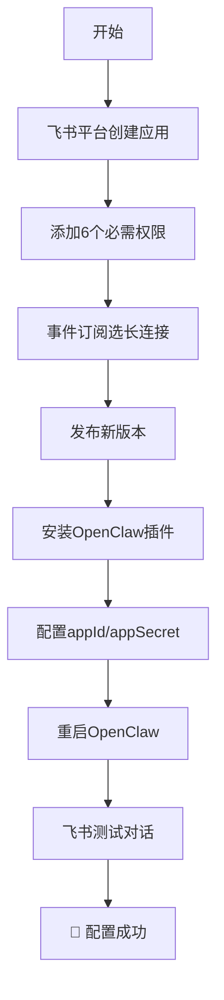

# OpenClaw 飞书接入完整配置指南


> 基于实际成功配置经验总结，避免常见配置陷阱
> 
> **已验证版本**：OpenClaw 2026.1.29 + @m1heng-clawd/feishu 0.1.4

## 🎯 快速开始

### 一句话总结
**使用WebSocket长连接，不需要Webhook，10分钟完成配置**

### 配置流程图


## 📦 安装插件

```bash
# 安装飞书插件
openclaw plugins install @m1heng-clawd/feishu

# 验证安装
openclaw plugins list | grep feishu
```

## ⚙️ 飞书平台配置

### 1. 创建应用
1. 访问 [飞书开放平台](https://open.feishu.cn)
2. 创建"企业自建应用"
3. 记录 **App ID** 和 **App Secret**

### 2. 添加权限（6个必需）
| 权限 | 用途 |
|------|------|
| `contact:user.base:readonly` | 读取用户信息 |
| `im:message` | 消息收发 |
| `im:message.p2p_msg:readonly` | 读取私聊 |
| `im:message.group_at_msg:readonly` | 读取群聊@消息 |
| `im:message:send_as_bot` | 发送消息 |
| `im:resource` | 媒体文件 |

### 3. 事件订阅（关键步骤！）
- **配置方式**：选择 **"使用长连接接收事件"**
- **不要选择Webhook**
- **不需要填写回调URL**
- 添加事件：`im.message.receive_v1`

### 4. 发布版本
创建新版本 → 包含所有权限 → 发布

## 🔧 OpenClaw配置

编辑 `~/.openclaw/openclaw.json`：

```json
{
  "channels": {
    "feishu": {
      "enabled": true,
      "appId": "cli_xxxxxxxxxx",
      "appSecret": "xxxxxxxxxx",
      "domain": "feishu",
      "connectionMode": "websocket",  // ← 必须为websocket
      "dmPolicy": "pairing",
      "groupPolicy": "allowlist",
      "requireMention": true,
      "mediaMaxMb": 30,
      "renderMode": "auto"
    }
  }
}
```

## 🚀 测试验证

```bash
# 重启OpenClaw
openclaw gateway restart

# 查看插件状态
openclaw plugins info feishu
```

在飞书中：
1. 搜索你的机器人
2. 发送：`@机器人 你好`
3. 应该收到回复

## ❓ 常见问题

### Q: 为什么收不到消息？
**A**: 99%的原因是事件订阅选择了Webhook而不是长连接

### Q: 错误 99991672 怎么办？
**A**: 添加 `contact:user.employee_id:readonly` 权限

### Q: 需要ngrok吗？
**A**: **不需要**！WebSocket是客户端主动连接

### Q: 需要Verification Token吗？
**A**: **不需要**！长连接方式不需要token

## 🛠️ 高级功能

### 文档工具
```bash
# 查看所有文档工具
openclaw plugins info feishu | grep feishu_doc

# 需要额外权限：
# - docx:document:readonly
# - docx:document
# - docx:document.block:convert
```

### 配置示例
```yaml
# 完整配置
feishu:
  enabled: true
  appId: "cli_xxxx"
  appSecret: "secret"
  connectionMode: "websocket"  # 关键！
  domain: "feishu"            # 或 "lark"（国际版）
  dmPolicy: "pairing"         # 私聊策略
  groupPolicy: "allowlist"    # 群聊策略
  requireMention: true        # 群聊需要@提及
  renderMode: "auto"          # 消息渲染模式
```

## 📊 配置检查清单

- [ ] 飞书应用已创建（App ID/Secret）
- [ ] 6个必需权限已添加
- [ ] 事件订阅选择"长连接"
- [ ] 已发布新版本
- [ ] OpenClaw插件已安装
- [ ] 配置文件已更新（connectionMode: "websocket"）
- [ ] OpenClaw已重启
- [ ] 飞书中能找到机器人

## 🔍 故障排除

### 查看日志
```bash
# OpenClaw日志
tail -f /tmp/openclaw/openclaw-*.log | grep -i feishu

# 飞书插件日志
grep -i "feishu\|websocket" /tmp/openclaw/openclaw-*.log
```

### 重新安装
```bash
# 卸载重装
openclaw plugins remove feishu
openclaw plugins install @m1heng-clawd/feishu
openclaw gateway restart
```

### 最小化测试
```json
{
  "channels": {
    "feishu": {
      "enabled": true,
      "appId": "你的ID",
      "appSecret": "你的Secret",
      "connectionMode": "websocket"
    }
  }
}
```

## 📚 详细文档

完整配置指南请查看：[OpenClaw-Feishu-Configuration-Guide.md](OpenClaw-Feishu-Configuration-Guide.md)

## 🤝 贡献

发现问题或有改进建议？欢迎提交 Issue 或 PR！

## 📄 许可证

MIT License

## 🙏 致谢

- [OpenClaw](https://github.com/openclaw/openclaw) - 开源AI助手框架
- [@m1heng-clawd/feishu](https://github.com/m1heng/clawdbot-feishu) - 飞书插件
- 所有贡献者和用户

---

**最后更新**: 2026年1月31日  
**测试环境**: Ubuntu 22.04, Node.js v24.11.1  
**已验证**: ✅ 消息收发 ✅ 文档操作 ✅ 稳定运行