# OpenClaw Feishu Integration Complete Configuration Guide


> Based on actual successful configuration experience, avoiding common configuration pitfalls
> 
> **Verified Version**: OpenClaw 2026.1.29 + @m1heng-clawd/feishu 0.1.4

## 🎯 Quick Start

### One-Sentence Summary
**Use WebSocket long connection, no Webhook needed, complete configuration in 10 minutes**

### Configuration Flowchart

```mermaid
graph TD
    A[Start] --> B[Create Feishu App]
    B --> C[Add 6 Required Permissions]
    C --> D[Event Subscription: Long Connection]
    D --> E[Publish New Version]
    E --> F[Install OpenClaw Plugin]
    F --> G[Configure appId/appSecret]
    G --> H[Restart OpenClaw]
    H --> I[Test Conversation in Feishu]
    I --> J[🎉 Configuration Successful]
```


## 📦 Install Plugin

```bash
# Install Feishu plugin
openclaw plugins install @m1heng-clawd/feishu

# Verify installation
openclaw plugins list | grep feishu
```

## ⚙️ Feishu Platform Configuration

### 1. Create Application
1. Visit [Feishu Open Platform](https://open.feishu.cn)
2. Create "Enterprise Self-built Application"
3. Record **App ID** and **App Secret**

### 2. Add Permissions (6 Required)
| Permission | Purpose |
|------------|---------|
| `contact:user.base:readonly` | Read user information |
| `im:message` | Send/receive messages |
| `im:message.p2p_msg:readonly` | Read private messages |
| `im:message.group_at_msg:readonly` | Read group @ messages |
| `im:message:send_as_bot` | Send messages as bot |
| `im:resource` | Media files |

### 3. Event Subscription (Critical Step!)
- **Configuration Method**: Select **"Use Long Connection to Receive Events"**
- **Do NOT select Webhook**
- **No callback URL needed**
- Add event: `im.message.receive_v1`

### 4. Publish Version
Create new version → Include all permissions → Publish

## 🔧 OpenClaw Configuration

Edit `~/.openclaw/openclaw.json`:

```json
{
  "channels": {
    "feishu": {
      "enabled": true,
      "appId": "cli_xxxxxxxxxx",
      "appSecret": "xxxxxxxxxx",
      "domain": "feishu",
      "connectionMode": "websocket",  // ← Must be websocket
      "dmPolicy": "pairing",
      "groupPolicy": "allowlist",
      "requireMention": true,
      "mediaMaxMb": 30,
      "renderMode": "auto"
    }
  }
}
```

## 🚀 Test Verification

```bash
# Restart OpenClaw
openclaw gateway restart

# Check plugin status
openclaw plugins info feishu
```

In Feishu:
1. Search for your bot
2. Send: `@bot Hello`
3. Should receive reply

## ❓ FAQ

### Q: Why no messages received?
**A**: 99% reason is selecting Webhook instead of Long Connection for event subscription

### Q: Error 99991672?
**A**: Add `contact:user.employee_id:readonly` permission

### Q: Need ngrok?
**A**: **No need**! WebSocket is client-initiated connection

### Q: Need Verification Token?
**A**: **No need**! Long connection doesn't require token

## 🛠️ Advanced Features

### Document Tools
```bash
# View all document tools
openclaw plugins info feishu | grep feishu_doc

# Additional permissions needed:
# - docx:document:readonly
# - docx:document
# - docx:document.block:convert
```

### Configuration Example
```yaml
# Complete configuration
feishu:
  enabled: true
  appId: "cli_xxxx"
  appSecret: "secret"
  connectionMode: "websocket"  # Key!
  domain: "feishu"            # or "lark" (international)
  dmPolicy: "pairing"         # Direct message policy
  groupPolicy: "allowlist"    # Group policy
  requireMention: true        # Need @mention in groups
  renderMode: "auto"          # Message render mode
```

## 📊 Configuration Checklist

- [ ] Feishu app created (App ID/Secret)
- [ ] 6 required permissions added
- [ ] Event subscription: "Long Connection"
- [ ] New version published
- [ ] OpenClaw plugin installed
- [ ] Config file updated (connectionMode: "websocket")
- [ ] OpenClaw restarted
- [ ] Bot found in Feishu

## 🔍 Troubleshooting

### View Logs
```bash
# OpenClaw logs
tail -f /tmp/openclaw/openclaw-*.log | grep -i feishu

# Feishu plugin logs
grep -i "feishu\|websocket" /tmp/openclaw/openclaw-*.log
```

### Reinstall
```bash
# Uninstall and reinstall
openclaw plugins remove feishu
openclaw plugins install @m1heng-clawd/feishu
openclaw gateway restart
```

### Minimal Test
```json
{
  "channels": {
    "feishu": {
      "enabled": true,
      "appId": "your_id",
      "appSecret": "your_secret",
      "connectionMode": "websocket"
    }
  }
}
```

## 📚 Detailed Documentation

Complete configuration guide: [OpenClaw-Feishu-Configuration-Guide.md](OpenClaw-Feishu-Configuration-Guide.md)

## 🤝 Contribution

Found issues or have suggestions? Welcome to submit Issue or PR!

## 📄 License

MIT License

## 🙏 Acknowledgments

- [OpenClaw](https://github.com/openclaw/openclaw) - Open source AI assistant framework
- [@m1heng-clawd/feishu](https://github.com/m1heng/clawdbot-feishu) - Feishu plugin
- All contributors and users

---

**Last Updated**: January 31, 2026  
**Test Environment**: Ubuntu 22.04, Node.js v24.11.1  
**Verified**: ✅ Message sending/receiving ✅ Document operations ✅ Stable operation