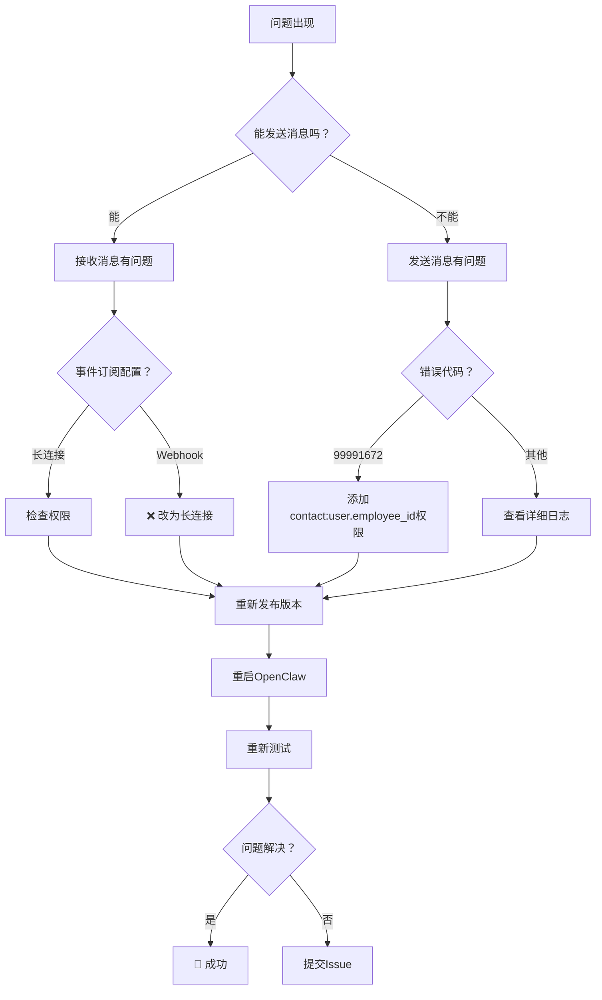

# 故障排除指南

## 🔍 问题诊断流程



## 🚨 常见错误及解决方案

### 错误 99991672: Access denied
```
错误信息：Access denied. One of the following scopes is required: [contact:user.employee_id:readonly]
```

**原因**：缺少 `contact:user.employee_id:readonly` 权限

**解决**：
1. 登录飞书开放平台
2. 进入"权限管理"
3. 搜索并添加 `contact:user.employee_id:readonly`
4. 发布新版本
5. 重启OpenClaw

### 错误 99991663: Bot not activated
```
错误信息：Bot is not activated
```

**原因**：机器人未激活或权限未生效

**解决**：
1. 在飞书中找到机器人并开始对话
2. 确认所有权限已添加并发布
3. 等待1-2分钟让权限生效
4. 重启OpenClaw

### 错误：收不到消息但能发送

**原因**：事件订阅配置错误

**解决**：
1. 确认事件订阅选择 **"使用长连接接收事件"**
2. 确认添加了 `im.message.receive_v1` 事件
3. **不要选择Webhook**
4. **不要填写回调URL**

### 错误：连接超时或断开

**原因**：网络问题或WebSocket连接问题

**解决**：
1. 检查网络连接
2. 查看OpenClaw日志：`tail -f /tmp/openclaw/openclaw-*.log`
3. 重启OpenClaw：`openclaw gateway restart`
4. 检查防火墙是否阻止WebSocket连接

## 📊 日志分析

### 查看相关日志
```bash
# 查看所有飞书相关日志
grep -i "feishu\|websocket\|长连接" /tmp/openclaw/openclaw-*.log

# 实时查看日志
tail -f /tmp/openclaw/openclaw-2026-01-31.log | grep -i feishu

# 查看错误日志
grep -i "error\|fail\|denied\|timeout" /tmp/openclaw/openclaw-*.log | grep -i feishu
```

### 正常日志示例
```
[feishu] Connecting to Feishu WebSocket...
[feishu] WebSocket connected successfully
[feishu] Received message from user: ou_xxxx
[feishu] Sent reply to user: ou_xxxx
```

### 错误日志示例
```
[feishu] WebSocket connection failed: 403 Forbidden
[feishu] Error: Missing required permission
[feishu] Message send failed: 99991672
```

## 🛠️ 分步排查

### 第一步：检查基本连接
```bash
# 测试令牌获取
curl -X POST https://open.feishu.cn/open-apis/auth/v3/tenant_access_token/internal \
  -H "Content-Type: application/json" \
  -d '{"app_id":"你的AppID","app_secret":"你的AppSecret"}'
```

### 第二步：检查插件状态
```bash
# 查看插件信息
openclaw plugins info feishu

# 查看已安装插件
openclaw plugins list | grep feishu
```

### 第三步：检查配置
```bash
# 查看当前配置
grep -A 10 '"feishu"' ~/.openclaw/openclaw.json

# 验证配置格式
python3 -m json.tool ~/.openclaw/openclaw.json | grep -A 10 feishu
```

### 第四步：重启服务
```bash
# 重启OpenClaw
openclaw gateway restart

# 检查服务状态
openclaw gateway status
```

## 🔄 重置配置

### 方法一：最小化配置
```bash
# 备份原配置
cp ~/.openclaw/openclaw.json ~/.openclaw/openclaw.json.backup

# 使用最小配置
cat > ~/.openclaw/openclaw.json << EOF
{
  "channels": {
    "feishu": {
      "enabled": true,
      "appId": "你的AppID",
      "appSecret": "你的AppSecret",
      "connectionMode": "websocket"
    }
  }
}
EOF

# 重启
openclaw gateway restart
```

### 方法二：重新安装插件
```bash
# 卸载插件
openclaw plugins remove feishu

# 清除缓存
rm -rf ~/.openclaw/extensions/feishu

# 重新安装
openclaw plugins install @m1heng-clawd/feishu

# 重新配置
openclaw gateway restart
```

## 📞 获取帮助

### 检查清单
- [ ] 飞书平台权限配置正确
- [ ] 事件订阅选择"长连接"
- [ ] 已发布新版本
- [ ] OpenClaw配置正确
- [ ] 插件已安装并启用
- [ ] OpenClaw已重启
- [ ] 在飞书中能找到机器人

### 提供信息
如果问题仍未解决，请提供以下信息：
1. OpenClaw版本：`openclaw --version`
2. 飞书插件版本：`openclaw plugins info feishu`
3. 错误日志片段
4. 飞书平台配置截图
5. OpenClaw配置文件（隐藏敏感信息）

### 社区支持
- OpenClaw GitHub: https://github.com/openclaw/openclaw
- 飞书插件GitHub: https://github.com/m1heng/clawdbot-feishu
- OpenClaw Discord: https://discord.gg/clawd

## 🎯 快速修复脚本

```bash
#!/bin/bash
# feishu-quick-fix.sh

echo "🔧 飞书连接快速修复脚本"
echo "========================"

# 1. 检查配置
echo "1. 检查配置..."
if grep -q '"connectionMode": "websocket"' ~/.openclaw/openclaw.json; then
    echo "   ✅ connectionMode配置正确"
else
    echo "   🔧 修复connectionMode配置"
    sed -i 's/"connectionMode":.*/"connectionMode": "websocket",/' ~/.openclaw/openclaw.json
fi

# 2. 重启服务
echo "2. 重启OpenClaw..."
openclaw gateway restart

# 3. 检查状态
echo "3. 检查状态..."
sleep 2
openclaw plugins info feishu | grep -i "status\|version"

echo ""
echo "📋 修复完成！"
echo "请在飞书中测试发送消息。"
```

保存为 `feishu-quick-fix.sh`，运行：`chmod +x feishu-quick-fix.sh && ./feishu-quick-fix.sh`